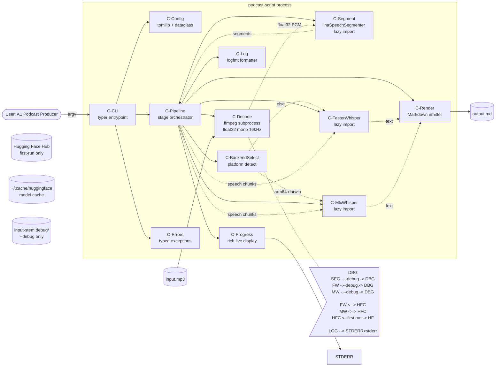
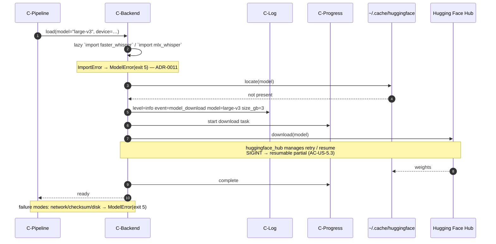

# System Design — v1.0  (confidence: 97%)

## Changelog
- v1.0 (2026-04-25) — finalized. All 17 ADRs flipped to `Status: Accepted` and stamped 2026-04-25; ADRs are now immutable. `## Open questions (this round)` section stripped. `## Resolved questions` retained as the audit trail. `SYSTEM_DESIGN.md` becomes the working reference for the design; `docs/adr/` is the canonical decision record.
- v0.4 (2026-04-25) — resolved Q11–Q14: SIGINT caught at C-CLI → exit 1 (Q11, default); `--debug` directory refuse-without-`--force` mirroring US-6 (Q12, default); decoded PCM is `float32` mono 16 kHz (Q13, default); **three-tier test strategy** unit / contract / integration (Q14 — user moved off the two-tier default to add a contract-tests-against-fakes layer that guards the `WhisperBackend` Protocol against fake-vs-real drift). Drafted ADR-0014 through ADR-0017. Closed risks #5 (PCM dtype locked) and #8 (SIGINT) from v0.3.
- v0.3 (2026-04-25) — resolved Q6–Q10 (all defaults kept): backend `load()` is eager before decode (Q6); transcribe progress ticks pipeline-level per speech segment (Q7); heavy imports lazy inside stage `load()` methods (Q8); 22-event v1.0 catalogue frozen (Q9); config uses stdlib `tomllib` + `dataclass` (Q10). Drafted ADR-0009 through ADR-0013.
- v0.2 (2026-04-25) — resolved Q1–Q5 (all defaults kept): ADR format Nygard (Q1); pipeline = explicit orchestrator class (Q2); error→exit-code via typed exception hierarchy (Q3); flat `src/podcast_script/` + `backends/` subpackage (Q4); rich+logfmt coexistence (Q5). Drafted ADR-0001 through ADR-0008.
- v0.1 (2026-04-25) — initial draft seeded from `SRS.md` v1.0 + `PROJECT_BRIEF.md` v1.0.

## Confidence by area
- Architectural style: 100%
- Component decomposition: 100%
- Inter-component communication: 100%
- Data architecture: 100%
- Deployment topology: 95%
- AuthN / AuthZ architecture: N/A (local CLI, no users — SRS §11)
- Cross-cutting (cache / queue / search): 100%
- Observability architecture: 100%
- Security architecture: 85%
- Module / package layout: 100%
- Class / type diagrams: 100%
- Database schemas: N/A (no persistent state beyond on-disk model caches)
- API contracts: 100%
- Sequence diagrams: 95%
- State machines: N/A (no stateful entities)
- Error handling & retries: 100%
- Concurrency model: 100%
- UI — information architecture: 95% (CLI grammar locked)
- UI — wireframes: N/A (no GUI)
- UI — visual style: N/A
- UI — interaction patterns: 100%
- ADR coverage: 100% (17 ADRs Accepted)

## 0. Inputs
- SRS: `SRS.md` v1.0 (2026-04-25, 93% confidence)
- Brief: `PROJECT_BRIEF.md` v1.0 (2026-04-25, 91% confidence)
- Existing ADRs: 0001–0017 in `docs/adr/` (all `Status: Accepted`, stamped 2026-04-25, immutable)

## 1. Design goals & constraints

Distilled from the SRS — what the design must satisfy.

**Functional drivers (must support):**
- US-1 transcribe single file → Markdown next to input.
- US-2 inline music markers (English `music starts`/`music ends`).
- US-3 progress bar over decode → segment → transcribe phases.
- US-4 config-file defaults overridable by CLI.
- US-5 first-run model download with stderr notice.
- US-6 atomic refuse-overwrite-without-`--force`.
- US-7 `--debug` artifact directory next to input.

**NFR drivers (with thresholds):**
- NFR-2 — peak RSS independent of episode length ⇒ **streaming per-speech-segment transcribe** (ADR-0004); ~220 MB/h for `float32` PCM (ADR-0016) is constant-proportion, not unbounded.
- NFR-3 — non-decreasing time order in output ⇒ **single-pass merge sort by segment start**.
- NFR-5 — atomic output ⇒ **`tempfile` in same dir + `os.replace`** on success only (ADR-0005).
- NFR-6 — first-run download notice within 1 s ⇒ **eager backend `load()` before decode** (ADR-0009).
- NFR-7 — runs unchanged on macOS 14+ (Apple Silicon) and Ubuntu LTS ⇒ **platform-detection at backend selection** (ADR-0003); progress UX identical across platforms (ADR-0010).
- NFR-8 — `ruff` + `mypy --strict` + ≥ 80% coverage ⇒ **typed Protocols** (ADR-0003); `frozen=True, slots=True` Config (ADR-0013); **three-tier test strategy** with 100% coverage on the segmentation-merge module reachable in Tier 1 unit tests (ADR-0017).
- NFR-9 — exit codes 0–6 ⇒ **typed exception hierarchy** (ADR-0006); SIGINT collapsed to exit 1 (ADR-0014).
- NFR-10 — every log line is logfmt key=value ⇒ **`LogfmtFormatter` on `RichHandler` via `Progress.console`** (ADR-0008); v1.0 event catalogue frozen at 22 tokens (ADR-0012).

**Constraint envelope (locked from brief & SRS, not up for design):**
- Stack: Python 3.12+, `uv` + `hatchling`, `typer`, `rich`, `ffmpeg` (system dep), `inaSpeechSegmenter`, `faster-whisper` + `mlx-whisper`, `huggingface_hub`, `soundfile`/`numpy`. **No additional runtime deps** (ADR-0013).
- Distribution: GitHub repo only; `git clone` + `uv sync`.
- License: MIT.
- CLI grammar: SRS §9.1 (locked).
- Output format: SRS §1.6 (locked).
- Supported `--lang` codes: SRS §1.7 (the eight: es/en/pt/fr/de/it/ca/eu).
- Exit-code policy: NFR-9 (locked integer values).
- Log format: NFR-10; v1.0 event catalogue: ADR-0012.
- Backend abstraction: `WhisperBackend` Protocol (ADR-0003).
- PCM format: `float32` mono 16 kHz (ADR-0016).

## 2. High-level design (HLD)

### 2.1 Architectural style
**Pipes-and-filters pipeline** inside a single Python process, implemented as an **explicit `Pipeline` orchestrator class** (`src/podcast_script/pipeline.py`). Each stage (decode → segment → transcribe → render) is a separate module; `Pipeline` calls each stage in order, holds cross-stage state, owns the progress wiring, and performs the atomic temp-then-rename of the output file. Stages are injected via constructor for testability.

**ADR:** ADR-0002.

### 2.2 Component diagram



### 2.3 Components

- **C-CLI** — typer entrypoint. Parses argv, calls C-Config, validates pre-conditions (input exists, output parent exists, output absent or `--force`, `<input-stem>.debug/` absent or `--force` if `--debug` is set, `ffmpeg` on PATH, `--lang` in supported set), instantiates C-Pipeline, catches `PodcastScriptError` and `KeyboardInterrupt` (ADR-0006, ADR-0014), emits the locked logfmt summary line on success.

- **C-Config** — loads `~/.config/podcast-script/config.toml` via stdlib `tomllib`, merges with CLI flags into a `frozen=True, slots=True` `Config` dataclass (ADR-0013). Validates `lang/model/backend/device` against allowed sets; raises `UsageError` (exit 2) with did-you-mean suggestion (Levenshtein ≤ 2) on lang miss.

- **C-Pipeline** — orchestrates the stage sequence (ADR-0002). Canonical ordering (ADR-0009): validate → backend `load()` → decode → segment → transcribe-loop → render → atomic-write. Holds the streaming contract (ADR-0004); ticks progress per speech segment (ADR-0010); writes via `tempfile.NamedTemporaryFile(dir=output.parent, …)` and `os.replace` on success (ADR-0005).

- **C-Decode** — wraps `ffmpeg` with the canonical invocation `ffmpeg -i <input> -f f32le -ar 16000 -ac 1 -hide_banner -loglevel error -` (ADR-0016) producing `np.ndarray[np.float32]` mono 16 kHz. Uses `subprocess.run` with `args` as a list — handles EC-3 paths with spaces / non-ASCII safely on POSIX. Captures total duration. Records the literal `ffmpeg` argv list (joined with `shlex.join`) for `commands.txt`. Maps non-zero `ffmpeg` exit to `DecodeError` (exit 4 — ADR-0006). Under `--debug`, writes `decoded.wav` (WAV `int16` for human-tool compatibility) separately.

- **C-Segment** — wraps `inaSpeechSegmenter`. Returns ordered `Segment` triples (`start`, `end`, `label`) covering the full duration (NFR-4). Emits `segments.jsonl` under `--debug`. Heavy `inaSpeechSegmenter` (TensorFlow) import is **lazy** at `Segmenter.load()` (ADR-0011); import failures are wrapped in `ModelError`.

- **C-BackendSelect** — pure function `select_backend(platform, --backend, --device) -> WhisperBackend` (ADR-0003). Default rule: `arm64-darwin` → `MlxWhisper`, else `FasterWhisper`. Raises `UsageError` (exit 2) if `--backend mlx-whisper` requested on non-Apple-Silicon (E7).

- **C-FasterWhisper / C-MlxWhisper** — implement `WhisperBackend` Protocol (ADR-0003). Each lazily loads its library AND the requested model from the `huggingface_hub` cache inside `load()` (ADR-0011); on cache miss emits `event=model_download` notice + download progress (AC-US-5.1, UC-2 step 3). Network/import failure → `ModelError` (exit 5). PCM in is `float32` (ADR-0016).

- **C-Render** — pure function `render(segments, transcripts, fmt) -> str`. Drops `noise`/`silence` segments (AC-US-2.5). Emits English markers always (AC-US-2.2). Returns a single Markdown string; persistence is the pipeline's job.

- **C-Log** — `logging.Logger("podcast_script")` with a custom `LogfmtFormatter` on a `RichHandler` whose `console` is the `Progress.console` when a `Progress` is live, else a plain `Console(stderr=True)` (ADR-0008). Emits exclusively the 22 events in the v1.0 frozen catalogue (ADR-0012).

- **C-Progress** — `rich.progress.Progress` with three named tasks. Transcribe task ticks **once per speech segment** with `total=len(speech_segments)` (ADR-0010). Disabled on non-TTY stderr; not constructed under `--quiet`.

- **C-Errors** — `PodcastScriptError` base + `UsageError` / `InputIOError` / `DecodeError` / `ModelError` / `OutputExistsError` (ADR-0006). Each carries class-level `exit_code: int` and `event: str`. `OutputExistsError` is reused for both pre-existing output Markdown AND pre-existing `--debug` directory (ADR-0015).

### 2.4 Inter-component communication

All in-process Python function calls. Off-process actors: `ffmpeg` (subprocess) and Hugging Face Hub (first-run only via `huggingface_hub`).

**Streaming contract (NFR-2 — ADR-0004):** the pipeline iterates speech segments one-at-a-time when calling the backend. Decoded `float32` PCM is held end-to-end (~220 MB/h, ADR-0016).

**Cross-component error model (ADR-0006):** every component raises a subclass of `PodcastScriptError`. C-CLI catches the base class plus `KeyboardInterrupt` (ADR-0014). Stages do **not** catch broad exceptions. Lazy `import` failures are wrapped to `ModelError` (ADR-0011). Unexpected exceptions become exit code 1.

### 2.5 Data architecture

There is no database. Persistent state lives entirely in:

- **Per-run input:** the user's audio file (read-only).
- **Per-run output:** the resolved Markdown path; written via `tempfile.NamedTemporaryFile(dir=output.parent, suffix=".md.tmp")` then `os.replace` (ADR-0005).
- **Per-run debug artifacts (`--debug` only):** `<input-stem>.debug/{decoded.wav, segments.jsonl, transcribe.jsonl, commands.txt}` next to the input. **Pre-existence policy:** mirrors output Markdown — refuse-without-`--force`, exit 6 / `OutputExistsError` / `event=output_exists` (ADR-0015). Same exit code, same event token, same `-f` opt-in.
- **Long-lived caches (managed by libraries, not by us):**
  - `~/.cache/huggingface/` — Whisper model weights.
  - `inaSpeechSegmenter` model cache (smaller, location is library-controlled).
- **User config:** `~/.config/podcast-script/config.toml`, read-only from the tool.

### 2.6 Deployment topology

Local install only.

- **Install path:** `git clone <repo> && cd podcast-script && uv sync`.
- **Distribution:** GitHub repository (no PyPI / Homebrew / Docker).
- **Environments:** the user's machine. CI runs the full pipeline on Ubuntu + macOS GitHub Actions runners.
- **System dependencies:** `ffmpeg` on PATH.
- **Compute:** CPU by default; CUDA on Linux if present; Metal/MPS on Apple Silicon via MLX.
- **No additional runtime deps** beyond brief §5 (ADR-0013).

### 2.7 AuthN / AuthZ architecture
**N/A.** Local CLI, single user.

### 2.8 Cross-cutting

- **Caching:** N/A at the application level (model caches are library-managed).
- **Queues / streams:** N/A.
- **Search / analytics:** N/A.

The cross-cutting concerns are **logging + progress** (ADR-0008) and **lazy importing of heavy deps** (ADR-0011).

### 2.9 Observability architecture

- **Logs:** logfmt key=value to stderr (NFR-10). Single `logging.Logger("podcast_script")` with a custom `LogfmtFormatter` on a `RichHandler` whose `console` is the `Progress.console` (ADR-0008). Required keys on every line: `level`, `event`.
- **Event catalogue (FROZEN for v1.0.0 — ADR-0012):**

  | Group | Tokens |
  |-------|--------|
  | Lifecycle (4) | `startup`, `config_loaded`, `backend_selected`, `done` |
  | Model lifecycle (3) | `model_load_start`, `model_load_done`, `model_download` |
  | Phase boundaries (8) | `decode_start`, `decode_done`, `segment_start`, `segment_done`, `transcribe_start`, `transcribe_done`, `render_done`, `write_done` |
  | Terminal errors (6) | `usage_error`, `input_io_error`, `decode_error`, `model_error`, `output_exists`, `internal_error` |

  Locked key shapes:
  - `event=done` — `level=info event=done input=… output=… backend=… model=… lang=… duration_in_s=… duration_wall_s=…` (UC-1 step 10).
  - `event=model_download` — `level=info event=model_download model=… size_gb=…` (UC-2 step 3).
  - Every error event carries `code=<exit_code>` and `cause="<short summary>"`.
  - User-initiated abort (Ctrl-C) emits `level=warn event=internal_error code=1 cause="interrupted by user"` (ADR-0014).

- **Metrics / traces:** none in v1.
- **Crash reports:** stderr stack trace under `--debug`; one-line error otherwise.

### 2.10 Security architecture

- **Network boundaries:** only first-run egress to Hugging Face Hub. Subsequent runs offline.
- **Secrets:** none.
- **Encryption at rest / in transit:** N/A — local file IO; HF Hub uses HTTPS by default.
- **Threat model:**
  - **T1 — Path injection / arbitrary write.** `Path.resolve()`; reject if parent missing; never auto-create outside the explicit parent. The `<input-stem>.debug/` directory follows the same rule.
  - **T2 — Dependency supply chain.** Dependabot + `pip-audit` weekly cron in CI.
  - **T3 — Model integrity.** `huggingface_hub` checksum verification; surface errors as `ModelError`.

## 3. Low-level design (LLD)

### 3.1 Module / package layout (ADR-0007, updated for ADR-0017)

```
src/podcast_script/
    __init__.py          # version constant only
    __main__.py
    cli.py               # typer entrypoint, exit-code mapping, KeyboardInterrupt catch (ADR-0014)
    config.py            # Config dataclass, tomllib load + CLI merge (ADR-0013)
    errors.py            # PodcastScriptError + subclasses (ADR-0006)
    logging_setup.py     # LogfmtFormatter + RichHandler wiring (ADR-0008)
    progress.py          # rich Progress wrapper + non-TTY fallback
    pipeline.py          # Pipeline orchestrator (ADR-0002, 0004, 0005, 0009, 0010)
    decode.py            # ffmpeg → float32 PCM (ADR-0016)
    segment.py           # inaSpeechSegmenter wrapper (lazy TF — ADR-0011)
    render.py            # pure Markdown renderer
    backends/
        __init__.py
        base.py          # WhisperBackend Protocol + select_backend() (ADR-0003)
        faster.py        # FasterWhisperBackend (lazy import — ADR-0011)
        mlx.py           # MlxWhisperBackend (lazy import — ADR-0011)
tests/
    unit/                # Tier 1: pure logic + fakes; no real deps; ≤ 1 s suite
    contract/            # Tier 2: shared Protocol invariants run against fake AND real backends
    integration/         # Tier 3: full CLI on examples/sample.mp3 + tiny model per OS
    fixtures/
        sample.mp3       # ~60s LibriVox + CC0 music bed (SRS §14.1)
        sample_tiny.md   # CI reference output (tiny model)
        canción de prueba.mp3   # EC-3 path-with-spaces+non-ASCII coverage
examples/
    sample.mp3
    sample.md            # rendered with large-v3 (SRS §14.1)
    CREDITS.md
docs/
    adr/
        README.md
        0001-*.md ... 0017-*.md
    ARCHITECTURE.md      # the four-bullet one-pager (SRS §16.2)
```

**Dependency direction (acyclic):**
- `cli` → `{config, pipeline, errors, logging_setup}`.
- `pipeline` → `{decode, segment, render, progress, backends, errors}`.
- `backends/{faster, mlx}` → `backends/base` only.
- `errors` and `logging_setup` are leaves.
- `__init__.py` does NOT import any submodule eagerly (ADR-0011).

**Test-tier orchestration (ADR-0017):**
- Tier 1 runs on every PR + push (Ubuntu only, no heavy deps installed — proves the boundary).
- Tier 2 runs on every PR + push (Ubuntu + macOS, full deps; per-backend skip when its library isn't available).
- Tier 3 runs on every PR + push (Ubuntu + macOS, one backend each).

### 3.2 Class / type diagrams

```mermaid
classDiagram
    class Segment {
        +float start
        +float end
        +str label  // "speech" | "music" | "noise" | "silence"
    }

    class TranscribedSegment {
        +float start
        +float end
        +str text
    }

    class WhisperBackend {
        <<Protocol>>
        +transcribe(pcm: ndarray~float32~, lang: str, sample_rate: int) Iterable~TranscribedSegment~
        +load(model: str, device: str) None
        +name: str
    }

    class FasterWhisperBackend
    class MlxWhisperBackend
    class FakeBackend {
        // tests/contract — shared with Tier 1 unit fakes
    }

    class Config {
        <<frozen, slots>>
        +Path input
        +Path|None output
        +str lang
        +str model
        +str backend
        +str device
        +bool force
        +Verbosity verbosity
    }

    class PodcastScriptError {
        <<abstract>>
        +exit_code: int
        +event: str
    }
    class UsageError { +exit_code = 2; +event = "usage_error" }
    class InputIOError { +exit_code = 3; +event = "input_io_error" }
    class DecodeError { +exit_code = 4; +event = "decode_error" }
    class ModelError { +exit_code = 5; +event = "model_error" }
    class OutputExistsError { +exit_code = 6; +event = "output_exists" }

    WhisperBackend <|.. FasterWhisperBackend
    WhisperBackend <|.. MlxWhisperBackend
    WhisperBackend <|.. FakeBackend
    PodcastScriptError <|-- UsageError
    PodcastScriptError <|-- InputIOError
    PodcastScriptError <|-- DecodeError
    PodcastScriptError <|-- ModelError
    PodcastScriptError <|-- OutputExistsError
```



### 3.3 Database schemas
**N/A** — no persistent state beyond library-managed caches and the user's filesystem.

### 3.4 API contracts

The user-facing API is the CLI grammar (SRS §9.1, locked). The internal Python API is the `WhisperBackend` Protocol (ADR-0003); not stable in v1 (SRS §9.3).

**API-1 — CLI grammar (mirrored from SRS §9.1):**

```
podcast-script <input>
  --lang <code>          (one of: es, en, pt, fr, de, it, ca, eu)
  [-o, --output <path>]
  [-f, --force]
  [--model <tiny|base|small|medium|large-v3|large-v3-turbo>]
  [--backend <faster-whisper|mlx-whisper>]
  [--device <auto|cpu|cuda|mps>]
  [-v, --verbose | -q, --quiet | --debug]
```

Exit codes (NFR-9, ADR-0006, ADR-0014): `0` ok; `1` generic / interrupted-by-user; `2` usage; `3` input I/O; `4` decode; `5` model/network; `6` output exists.

**API-2 — `WhisperBackend` Protocol (internal, not stable in v1 — ADR-0003):**

```python
from typing import Protocol, Iterable, NamedTuple
import numpy as np

class TranscribedSegment(NamedTuple):
    start: float
    end: float
    text: str

class WhisperBackend(Protocol):
    name: str
    def load(self, model: str, device: str) -> None: ...
    def transcribe(
        self,
        pcm: np.ndarray,        # float32 mono (ADR-0016)
        lang: str,
        sample_rate: int = 16000,
    ) -> Iterable[TranscribedSegment]: ...
```

**API-3 — Config (internal — ADR-0013):**

```python
@dataclass(frozen=True, slots=True)
class Config:
    input: Path
    output: Path | None
    lang: str
    model: str
    backend: str
    device: str
    force: bool
    verbosity: Verbosity
```

**ffmpeg invocation (ADR-0016):**
```
ffmpeg -i <input> -f f32le -ar 16000 -ac 1 -hide_banner -loglevel error -
```

### 3.5 Sequence diagrams

#### SD-UC-1 — Transcribe a single audio file (links UC-1)

Canonical ordering (ADR-0009): validate → backend `load()` → decode → segment → transcribe-loop → render → atomic-write.

```mermaid
sequenceDiagram
    autonumber
    actor U as Producer
    participant CLI as C-CLI
    participant CFG as C-Config
    participant PIPE as C-Pipeline
    participant DEC as C-Decode (ffmpeg)
    participant SEG as C-Segment
    participant BS as C-BackendSelect
    participant BE as C-Backend (FW/MW)
    participant REN as C-Render
    participant FS as Filesystem
    participant LOG as C-Log

    U->>CLI: podcast-script ep.mp3 --lang es
    CLI->>CFG: load + merge (TOML, argv)
    CFG-->>CLI: Config
    CLI->>CLI: validate (lang, ffmpeg, paths,<br/>output absent or --force,<br/>debug-dir absent or --force if --debug)
    Note over CLI: on failure → typed exception → exit 2/3/6
    CLI->>LOG: level=info event=startup
    CLI->>LOG: level=info event=config_loaded
    CLI->>PIPE: run(config)
    PIPE->>BS: select(platform, backend, device)
    BS-->>PIPE: BackendInstance
    PIPE->>LOG: level=info event=backend_selected
    PIPE->>BE: load(model, device)  [eager — ADR-0009]
    Note over BE: lazy import library + check HF cache;<br/>on miss: event=model_download (within 1s)
    BE-->>PIPE: ready
    PIPE->>LOG: level=info event=model_load_done
    PIPE->>DEC: decode(input)  [ffmpeg → float32 mono 16kHz — ADR-0016]
    DEC-->>PIPE: pcm: ndarray[float32], duration_s
    PIPE->>LOG: level=info event=decode_done duration_in_s=…
    PIPE->>PIPE: choose fmt = "MM:SS" if duration<3600 else "HH:MM:SS"
    PIPE->>SEG: segment(pcm)
    SEG-->>PIPE: [Segment, ...] covering full duration
    PIPE->>LOG: level=info event=segment_done n_segments=…
    PIPE->>PIPE: tasks.transcribe.total = len(speech_segments)
    loop one tick per speech segment (ADR-0004, ADR-0010)
        PIPE->>BE: transcribe(pcm[start:end], lang)
        BE-->>PIPE: Iterable[TranscribedSegment]
        PIPE->>PIPE: progress.advance(transcribe, 1)
    end
    PIPE->>LOG: level=info event=transcribe_done n_speech_segments=…
    PIPE->>REN: render(segments, transcripts, fmt)
    REN-->>PIPE: markdown_str
    PIPE->>LOG: level=info event=render_done
    PIPE->>FS: tempfile.NamedTemporaryFile(dir=output.parent)
    PIPE->>FS: os.replace(tmp, output)  (atomic — ADR-0005)
    PIPE->>LOG: level=info event=write_done output=…
    PIPE-->>CLI: ok
    CLI->>LOG: level=info event=done input=… output=… backend=… …
    CLI-->>U: exit 0
```

**Failure annotations:**
- Step 5 (validate) failures short-circuit before any backend or decode work; covers both output-Markdown and `--debug` dir pre-existence (ADR-0015).
- Step 12 (backend `load`) network/cache/ImportError → `ModelError` (exit 5).
- Step 16 (decode) `ffmpeg` non-zero → `DecodeError` (exit 4).
- Step 24 (transcribe loop) backend error → `ModelError` (exit 5); no temp file exists.
- Step 30 (write/replace) failure → temp file unlinked in `finally`; pre-existing output untouched (ADR-0005).
- **SIGINT mid-pipeline** at any step → `KeyboardInterrupt` propagates to outermost `cli.py` catch; emits `level=warn event=internal_error code=1 cause="interrupted by user"`; stage `finally` blocks run normally (ADR-0014).

#### SD-UC-2 — First-run model download (links UC-2)



### 3.6 State machines
**N/A.**

### 3.7 Error handling & retry strategy (ADR-0006, ADR-0014)

**Exception → exit code:**

| Exception            | exit_code | event token         | Trigger                                                    | UC-1 ref |
|----------------------|-----------|---------------------|------------------------------------------------------------|----------|
| `UsageError`         | 2         | `usage_error`       | bad flags, unsupported `--lang`, ffmpeg not on PATH, backend incompatible | E2, E4, E7 |
| `InputIOError`       | 3         | `input_io_error`    | input missing/unreadable, output parent missing            | E1, E6   |
| `DecodeError`        | 4         | `decode_error`      | ffmpeg exit ≠ 0                                            | E5       |
| `ModelError`         | 5         | `model_error`       | model load / download / network / cache / `ImportError` wrap | E8, UC-2 |
| `OutputExistsError`  | 6         | `output_exists`     | output Markdown OR `--debug` dir exists without `--force`  | E3, ADR-0015 |
| `KeyboardInterrupt`  | 1         | `internal_error`    | user pressed Ctrl-C                                         | ADR-0014 |
| (any other)          | 1         | `internal_error`    | unexpected internal error                                  | E9       |

**Retry policy:** none in our code. `huggingface_hub` handles its own retries.

**Idempotency:** the tool is naturally idempotent for re-runs without `--force` (it refuses, exit 6). With `--force`, the atomic replace gives us "either the new transcript or the previous one" — never a half-file.

**Cleanup on failure:** the temp file (if any) is unlinked in a `finally` block — runs on `KeyboardInterrupt` too because the catch is at the outermost `try` (ADR-0014). The `<input-stem>.debug/` directory is **not** cleaned on failure (US-7 — partial artifacts are the value).

### 3.8 Concurrency model

Single-threaded Python, single process. Concurrent elements: `ffmpeg` subprocess (off-process, blocking wait) and `rich.progress.Progress`'s internal refresh thread. No locks, no asyncio, no thread pool in v1. SIGINT is caught at the outermost `cli.py` `try` block (ADR-0014); stages do not install signal handlers.

## 4. User interface (CLI surface)

### 4.1 Command surface
The single command shape from SRS §9.1. No subcommands in v1.

### 4.2 Flag conventions
- Short aliases only for `-o`, `-f`, `-v`, `-q` (SRS §9.1, Q17).
- Long-form for the rest.
- Verbosity is mutually exclusive: `-v` xor `-q` xor `--debug`; `--debug` implies `-v` plus the artifact directory.
- `NO_COLOR` env var respected by `rich` automatically.
- `-f` / `--force` opts into BOTH output Markdown overwrite AND `--debug` dir overwrite (ADR-0015).

### 4.3 Output formats
- **stdout:** **nothing.**
- **stderr:** logfmt log lines (NFR-10) + the `rich` progress bar via one `Console` (ADR-0008).
- **Output file:** Markdown per SRS §1.6, atomic write (ADR-0005).
- **Debug directory (`--debug` only):** `decoded.wav` (WAV `int16`), `segments.jsonl`, `transcribe.jsonl`, `commands.txt` (AC-US-7.1). Refuse-without-`--force` if pre-existing (ADR-0015).

### 4.4 Interaction patterns
- **Loading / progress:** rich Progress bar with three named tasks. Transcribe ticks per speech segment (ADR-0010). Non-TTY fallback: one line per phase, no ANSI. `--quiet` suppresses entirely.
- **First-run download state:** stderr notice within 1 s + download progress bar (AC-US-5.1, ADR-0009).
- **Errors:** one-line `level=error event=<error_event> code=N cause="…"` on stderr; full traceback under `--debug`.
- **User-initiated abort (Ctrl-C):** one-line `level=warn event=internal_error code=1 cause="interrupted by user"`; exit 1 (ADR-0014).

### 4.5 Mockup & prototype handoff
N/A — `--help` text and the README quickstart are the spec.

## 5. Open risks

1. ~~**NFR-6 1 s download notice**~~ — closed by ADR-0009.
2. **rich + logfmt collision** — closed by ADR-0008. Implementation must follow the documented pattern.
3. **TensorFlow + MLX + faster-whisper combined install on macOS** (SRS Risk #5). CI must validate the combined install on Apple Silicon runners. Lazy-import policy (ADR-0011) ensures conflicts surface at the right phase. Still a real install-time risk; mitigation is CI-side.
4. ~~**`mlx-whisper` segment streaming**~~ — closed by ADR-0010.
5. ~~**`numpy` array lifetime / dtype**~~ — closed by ADR-0016 (`float32` locked, ~220 MB/h, acceptable per NFR-2).
6. **EC-3 path with non-ASCII + spaces** — `subprocess.run(["ffmpeg", "-i", str(path), …])` with a list (not a shell string) handles this on POSIX. Tier 3 integration test must include `canción de prueba.mp3` to actually exercise it (SRS §14.1).
7. ~~**Event catalogue stability**~~ — closed by ADR-0012.
8. ~~**SIGINT mid-pipeline**~~ — closed by ADR-0014.
9. **Fake-vs-real backend drift** — addressed structurally by Tier 2 contract tests (ADR-0017); residual risk is "we forget to assert a real-world invariant" rather than "the fake silently diverges".

## 6. ADR index

| ADR  | Title                                                                                  | Status   |
|------|----------------------------------------------------------------------------------------|----------|
| 0001 | ADR format — Michael Nygard                                                            | Accepted |
| 0002 | Architectural style — pipes-and-filters pipeline with explicit orchestrator class      | Accepted |
| 0003 | WhisperBackend Protocol abstraction                                                    | Accepted |
| 0004 | Streaming per-speech-segment transcribe for bounded peak RSS                           | Accepted |
| 0005 | Atomic output via temp file + rename                                                   | Accepted |
| 0006 | Error → exit-code mapping via typed exception hierarchy                                | Accepted |
| 0007 | Module layout — flat `src/podcast_script/` package + `backends/` subpackage            | Accepted |
| 0008 | Coexisting `rich` progress + logfmt logs on stderr via `Progress.console`              | Accepted |
| 0009 | Backend `load()` ordering — eager, before decode                                        | Accepted |
| 0010 | Transcribe progress tick granularity — pipeline-level, per speech segment               | Accepted |
| 0011 | Lazy-import policy for heavy dependencies                                               | Accepted |
| 0012 | Event catalogue freeze for v1.0.0                                                       | Accepted |
| 0013 | Config implementation — stdlib `tomllib` + `dataclasses.dataclass`                      | Accepted |
| 0014 | SIGINT / KeyboardInterrupt handling                                                     | Accepted |
| 0015 | `--debug` artifact directory pre-existence policy                                       | Accepted |
| 0016 | Decoded PCM format — `float32` mono 16 kHz                                              | Accepted |
| 0017 | Three-tier test strategy — unit / contract / integration                                | Accepted |

All 17 ADRs are on disk under `docs/adr/` with `Status: Accepted` (stamped 2026-04-25). They are immutable from this point — any future change supersedes via a new ADR.

## Resolved questions

### Q1 — ADR format — resolved in v0.2
**Selected:** Michael Nygard (kept default)
**Touches:** §6 ADR index, every ADR file
**ADR:** [docs/adr/0001-adr-format-nygard.md](docs/adr/0001-adr-format-nygard.md) (Accepted)

### Q2 — Pipeline implementation pattern — resolved in v0.2
**Selected:** Explicit `Pipeline` orchestrator class with stage methods + dependency injection (kept default)
**Touches:** §2.1, §2.3, §2.4, §3.1, §3.5
**ADR:** [docs/adr/0002-pipes-and-filters-pipeline.md](docs/adr/0002-pipes-and-filters-pipeline.md) (Accepted)

### Q3 — Error → exit-code mapping — resolved in v0.2
**Selected:** Typed exception hierarchy; class-level `exit_code` attribute (kept default)
**Touches:** §2.3, §2.4, §2.9, §3.2, §3.7
**ADR:** [docs/adr/0006-error-to-exit-code-via-typed-exceptions.md](docs/adr/0006-error-to-exit-code-via-typed-exceptions.md) (Accepted)

### Q4 — Module / package layout — resolved in v0.2
**Selected:** Flat `src/podcast_script/` + `backends/` subpackage (kept default)
**Touches:** §3.1
**ADR:** [docs/adr/0007-flat-src-package-layout.md](docs/adr/0007-flat-src-package-layout.md) (Accepted)

### Q5 — `rich` progress + logfmt coexistence — resolved in v0.2
**Selected:** Route `logging` through `Progress.console` (kept default)
**Touches:** §2.3, §2.9, §4.3, §4.4
**ADR:** [docs/adr/0008-rich-progress-and-logfmt-coexistence.md](docs/adr/0008-rich-progress-and-logfmt-coexistence.md) (Accepted)

### Q6 — Backend load ordering — resolved in v0.3
**Selected:** Eager: validate → load → decode → … (kept default)
**Touches:** §2.3, §2.4, §3.5, §5 Risk #1 (closed)
**ADR:** [docs/adr/0009-backend-load-ordering.md](docs/adr/0009-backend-load-ordering.md) (Accepted)

### Q7 — Transcribe progress tick granularity — resolved in v0.3
**Selected:** Pipeline-level ticks per speech segment (kept default)
**Touches:** §2.3, §3.5, §5 Risk #4 (closed)
**ADR:** [docs/adr/0010-pipeline-level-progress-tick.md](docs/adr/0010-pipeline-level-progress-tick.md) (Accepted)

### Q8 — Lazy-import policy — resolved in v0.3
**Selected:** Lazy: heavy `import` inside stage class `load()` (kept default)
**Touches:** §2.3, §2.4, §3.1, §5 Risk #3 (mitigation)
**ADR:** [docs/adr/0011-lazy-imports-for-heavy-deps.md](docs/adr/0011-lazy-imports-for-heavy-deps.md) (Accepted)

### Q9 — Event catalogue freeze — resolved in v0.3
**Selected:** All 22 pre-marked tokens; `transcribe_segment` rejected (kept default)
**Touches:** §2.9 (FROZEN), §3.7, §5 Risk #7 (closed)
**ADR:** [docs/adr/0012-event-catalogue-freeze.md](docs/adr/0012-event-catalogue-freeze.md) (Accepted)

### Q10 — Config implementation — resolved in v0.3
**Selected:** Stdlib `tomllib` + `dataclasses.dataclass` (kept default)
**Touches:** §2.3, §2.6, §3.1, §3.4
**ADR:** [docs/adr/0013-config-stdlib-tomllib-dataclass.md](docs/adr/0013-config-stdlib-tomllib-dataclass.md) (Accepted)

### Q11 — SIGINT / KeyboardInterrupt handling — resolved in v0.4
**Selected:** Catch `KeyboardInterrupt` at C-CLI; emit `event=internal_error code=1 cause="interrupted by user"`; exit 1 (kept default)
**Touches:** §2.3 (C-CLI), §2.9 (warn-level error), §3.7 mapping table, §3.8, §5 Risk #8 (closed)
**ADR:** [docs/adr/0014-sigint-keyboardinterrupt-handling.md](docs/adr/0014-sigint-keyboardinterrupt-handling.md) (Accepted)

### Q12 — `--debug` artifact directory pre-existence policy — resolved in v0.4
**Selected:** Refuse if `<input-stem>.debug/` exists; require `--force` to remove and recreate (kept default — mirrors US-6)
**Touches:** §2.3 (C-CLI validation), §2.5, §3.7 (`OutputExistsError` reused), §4.3
**ADR:** [docs/adr/0015-debug-dir-pre-existence-policy.md](docs/adr/0015-debug-dir-pre-existence-policy.md) (Accepted)

### Q13 — Decoded PCM dtype — resolved in v0.4
**Selected:** `float32` mono 16 kHz (`ffmpeg -f f32le -ar 16000 -ac 1`) (kept default)
**Touches:** §2.3 (C-Decode), §3.4 ffmpeg invocation, §5 Risk #5 (closed)
**ADR:** [docs/adr/0016-pcm-float32-mono-16khz.md](docs/adr/0016-pcm-float32-mono-16khz.md) (Accepted)

### Q14 — Test boundary — resolved in v0.4
**Selected:** **Three tiers** — unit / contract-tests-against-fake-backend / full integration (user moved off the two-tier default to add the contract layer that guards against fake-vs-real Protocol drift)
**Touches:** §3.1 `tests/{unit,contract,integration}/` directory layout, §5 Risk #9 (added — fake-vs-real drift residual), §6 ADR index
**ADR:** [docs/adr/0017-three-tier-test-strategy.md](docs/adr/0017-three-tier-test-strategy.md) (Accepted)
